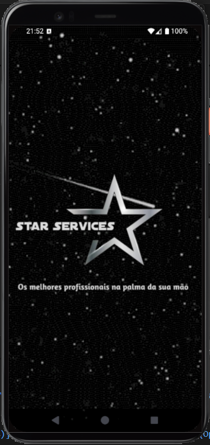
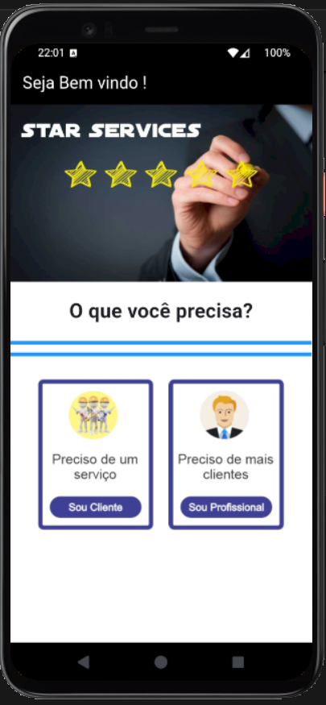
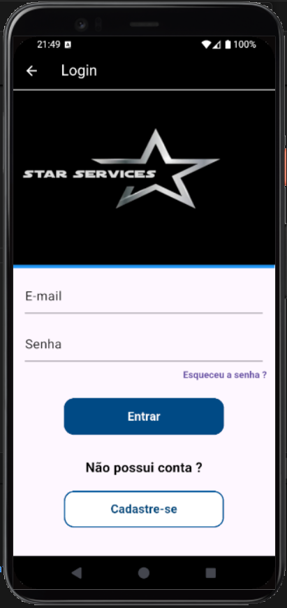

## 🎨 Design do Projeto

O protótipo deste aplicativo foi planejado e desenhado no **Figma**.

🔗 [Acesse o protótipo no Figma aqui](https://www.figma.com/design/fL0fMYUM2fROp82OehGWVu/App---Star-Services?node-id=0-1&p=f&t=WRtFJYLKw8RNMwkk-0)

## 📱 Telas do Aplicativo

O aplicativo de prestação de serviços da **Star Services** foi desenvolvido utilizando **Flutter** e **Dart**.

| Tela Splash | Tela Tipo de Usuário | Tela de Início |
| :---: | :---: | :---: |
|  |  |  |
